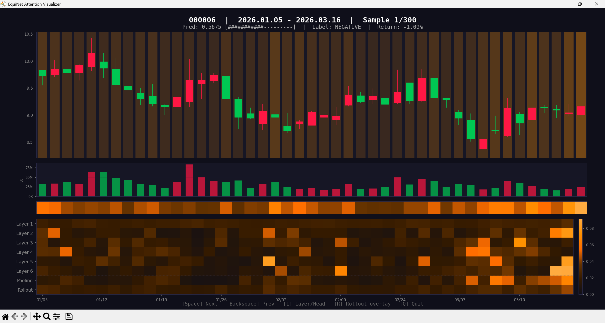

# EquiNet

## 项目简介

 - EquiNet基于历史数据进行统计建模，对未来3天是否具有短期上涨趋势进行打分

## 主要特性

- **架构主流**：BERT拥有一定的时序建模能力
- **训练监控**：每轮训练计算并显示各种评估指标
- **参数配置**：自定义模型配置以适应不同需求

## 目录结构

```
EquiNet/
├── out/                       # 模型权重输出
├── data_maintenance/          # 数据维护工具包
│   ├── equinet.db             # SQLite 数据库
│   ├── database.py            # SQLite 数据库管理
│   ├── update.py              # 数据更新（Baostock / AKShare）
│   ├── check.py               # 数据质量检查与修复
│   ├── select.py              # 股票筛选（全量池 → 训练池）
│   └── features.py            # 衍生特征计算
├── src/
│   ├── config.py              # 统一配置文件
│   ├── data.py                # 数据加载 / 样本生成 / 特征归一化 / 极端行情过滤
│   ├── model.py               # 模型架构（Post-Norm Transformer）
│   ├── train.py               # 主训练脚本
│   ├── training_utils.py      # 训练 / 评估工具模块
│   ├── run.py                 # 推理 / 选股 / 全区间回测脚本
│   ├── pretrain_embedding.py  # Embedding 预训练（SIGReg 几何正则）
│   ├── embedding_evaluator.py # Embedding 质量评估
│   ├── market_index.py        # 市场宽度计算（极端行情过滤的数据源）
│   └── ...                    # 其他模块
├── data_maintenance.py        # 数据维护工具入口
├── LICENSE                    # Apache-2.0许可证
└── README.md
```

## 数据架构说明

数据存储采用 SQLite 单数据库（`data_maintenance/equinet.db`），通过股票池（pool）机制管理：

- **全量池 (all)**：所有 A 股行情数据
- **训练池 (selected)**：经筛选后用于训练的股票子集

### 数据库表结构

- `stock_daily`：日行情数据（stock_code, date, OHLCV, exchange, vwap, m5, m10, m20）
- `stock_pool`：股票池管理（stock_code, pool_type, is_active）
- `stock_metadata`：股票元信息（stock_code, stock_name, market, is_st, market_cap）

> 数据维护（`data_maintenance/`）与数据使用（`src/`）完全隔离。`src/` 通过 SQLite 只读查询获取训练数据。

## 数据管理

通过 `data_maintenance.py` 交互式工具管理全部数据操作：
采用两级池架构：全量股票池→ 筛选训练数据池

```bash
python data_maintenance.py
```

菜单功能：

| 选项 | 功能 | 说明 |
|------|------|------|
| 0. SQL 控制台 | 手动执行 SQL | 用于调试和自定义查询 |
| 1. 更新数据 | 从外部数据源同步行情 | 支持增量 / 全量 / 训练池更新 |
| 2. 筛选股票 | 全量池 → 训练池 | 主板 + 排除ST + 活跃度 + 市值筛选 |
| 3. 检查数据质量 | 完整性验证与自动修复 | 缺失补拉、价格校验、OHLC逻辑检查 |
| 4. 计算特征 | 计算衍生特征 | 填充 m5/m10/m20 等多列 |
| 5. 数据库状态 | 查看统计信息 | 股票数、数据量、日期范围等 |
| 6. 备份数据库 | SQLite 内置备份 | 按时间戳保存到 data_maintenance/backup/ |

### 典型工作流

```bash
# 首次使用（从零开始）
python data_maintenance.py       # 选项1: 全量更新 → 选项2: 筛选 → 选项4: 计算特征
python src/market_index.py       # 生成 out/market_index.json（极端行情过滤的数据源）

# 日常维护
python data_maintenance.py       # 选项1: 增量更新 → 选项3: 检查质量
python src/market_index.py       # 行情更新后重新生成市场宽度数据

# 训练 & 推理
python src/train.py
python src/run.py
```

## 极端行情过滤

市场普涨/普跌日的标签由 beta 驱动而非个股主力运作，混入训练会稀释信号。项目据此剔除噪声标签：

1. 先用 `market_index.py` 统计每个交易日的全市场涨跌家数，输出 `out/market_index.json`：
   ```bash
   python src/market_index.py                 # 默认数据库
   python src/market_index.py --start 20200101 --end 20261231
   python src/market_index.py --open          # 生成后浏览器打开市场指数看板
   ```
2. 训练时 `data.py` 读取该文件，将未来窗口落在「涨跌比 ≥ 阈值」日期的样本整体剔除（既不作正样本也不作负样本）。

阈值与开关在 `config.py` 中配置：`EXCLUDE_EXTREME_MARKET`（总开关）、`EXTREME_UP_DOWN_RATIO`（涨跌比阈值，默认 50.0）。**未生成 `market_index.json` 时自动跳过过滤并打印提示，不影响训练**。

## 推理与全区间回测

```bash
python src/run.py                             # 默认：测试集区间评估 + 选股
python src/run.py --begin 20230101            # 全区间回测：从 2023-01-01 评估到最新
python src/run.py --begin 2023-03-01          # 容错：2023-03-01 / 2023/03/01 等写法均可
```

`--begin` 指定后评估区间变为 `[begin, 最新]`，忽略训练/验证/测试集划分——模型用 begin 之前的历史做上下文，首个预测日恰好落在 begin 当天（无数据泄漏）。区间过长时终端只显示首尾，完整逐日统计导出到 `out_run/daily_stats_<时间戳>.json`。

### 每日统计可视化

```bash
python src/visualize_daily.py                 # 自动取 out_run/ 下最新的 daily_stats_*.json
python src/visualize_daily.py out_run/xxx.json --open   # 指定文件并浏览器打开
```

读取每日统计 JSON 生成 HTML 看板，直观展示回测期间每个交易日的选股数量与收益率。

## 模型文件名格式说明示例

```
model_loss_top1_p1_11pct_thr0_485_auc0_6182_ep29_1214_1930.pth
  │         │    │          │        │       │      └── 时间戳
  │         │    │          │        │       └── 最佳轮次
  │         │    │          │        └── AUC
  │         │    │          └── 阈值（实盘用）
  │         │    └── 收益率
  │         └── Top-K
  └── 模型类型（model_loss / model_realistic）
```

model_loss - 按测试集loss保存的最佳模型
model_realistic - 按实战收益率保存的最佳模型
top1 - Top1%选股，k取1
p1_11pct - 收益率 +1.11% 在测试集上的收益率
thr0_485 - 阈值 0.485（预测值≥0.485即入选Top1%）
auc0_6182 - AUC 0.6182
ep29 - 第29轮
1214_1930 - 12月14日19:30
...可能有其它字段

## 环境配置示例

- 环境配置：environment.yaml

## 快速开始

1. **克隆项目 & 创建虚拟环境**
   ```bash
   git clone https://github.com/hujiyo/EquiNet-v2.git
   conda env create -f environment.yaml && conda activate equinet
   ```
2. **数据获取**（详见上方「数据管理」）
3. **生成市场宽度数据**（供极端行情过滤；不生成也可训练，会自动跳过）
   ```bash
   python src/market_index.py
   ```
4. **训练 & 选股**
   ```bash
   python src/train.py
   python src/run.py
   ```

## 注意力可视化工具

```bash
python src/visualize_attention.py
```



界面由上到下分为四个区域：

| 区域 | 内容 | 说明 |
|------|------|------|
| **K线图** | 45天OHLC蜡烛图 | 橙色背景高亮为 Rollout 注意力覆盖层，颜色越亮表示该天对预测的贡献越大 |
| **成交量** | 每日成交量柱状图 | 与K线共享时间轴 |
| **注意力强度条** | Rollout 归一化色带 | 一行薄色带，直观展示各天的综合注意力贡献强弱 |
| **注意力热力图** | 逐层/逐头注意力矩阵 | 行为各层自注意力均值 + Pooling 聚合注意力 + Attention Rollout，列为45个交易日 |

交互操作：`Space` 下一个样本 / `Backspace` 上一个 / `L` 切换逐层/逐头视图 / `R` 开关Rollout覆盖层 / `Q` 退出

## 项目修改LOG

- 2026.6.24:新增极端行情过滤（剔除市场普涨普跌日的噪声标签）与市场宽度工具；评估集支持 `--begin` 全区间回测；新增每日统计导出与 HTML 看板
- 2026.6:重构 MultiHeadAttention 为手写实现（LLaMA2 风格 per-head Q/K RMSNorm）；全栈对齐 Qwen3.5 使用 Zero-Centered RMSNorm；data.py 样本生成收敛至向量化批处理；重构 FFN-Embedding 结构与 embedding 预训练脚本；重构数据维护工具
- 2026.6.3:修正SIGReg的使用实现
- 2026.5:新增信号流诊断和注意力机制诊断脚本;修复SwiGLU的非主流实现;修复embedding预训脚本的warmup学习率错位;重构训练参数初始化策略;新增交互式注意力可视化工具;新增MC dropout推理机制
- 2026.5.29:模型采用Post-Norm架构
- 2026.5.22:新增MACD和布林带衍生特征
- 2026.5.13:重构Embedding预训练流程，替换原约束为SIGReg几何正则
- 2026.5:数据存储从CSV文件迁移至SQLite数据库;新增Embedding层预训练机制;彻底移除克隆模型训练策略+多教师模型纠偏机制;新增Embedding预训练模块;重构数据分割与训练流程，加入验证集支持
- 2026.5.5:添加日内均价特征(vwap);修复volume数据源错误
- 2026.4:将transformer的FFN子层替换为SwiGLU子层;移除DFT微调训练脚本及相关文档引用;将量能和换手率归一化方式从固定范围改为基于N日均值的相对变化率;添加Top K%精度指标并更新相关输出;添加PairwiseWeightedBCE损失函数支持排序学习（可选）;添加均线偏离度特征(m5,m10,m20)
- 2026.4.20谷雨:EquiNet v2归档，v3 start ~，方向:架构优化
- 2026.4:新增正样本距离保护;添加AMP混合精度支持并优化模型评估;使用残差+FFN-embedding替换线性embedding;添加日TopK收益统计;放弃复杂的TaskAlignedLoss机制;简化输出层为单层线性分类头,在分类头前增加归一化层,让backbone承担特征学习
- 2026.4.6:新增股票数据筛选功能并重构数据管理架构
- 2026.3:修复数据集维护更新脚本中更新时的单位错误、复权方式错误等问题，优化收益率计算策略。新增特征两阶段归一化处理流程，简化模型embedding层，新增embedding层评估脚本。
- 2026.3.8:EquiNet许可证从MIT改为Apache-2.0
- 2026.2:优化实战评分机制的计算方法，新增推理脚本、数据集维护更新脚本，优化部分模块，增加一些数据的可视化。区分涨跌幅与收益率的关系，将收益率的计算方法与实战进行统一。重新使用可学习位置编码嵌入。
- 2026.2.13:从简单涨幅阈值预测改为短期强势信号检测机制判断，减少了"有趋势但被标0"的矛盾样本，明确了模型的预测目标。二分类强迫模型做买卖二选一，新标签机制为扩展模型规模打下稳定性基础。新增实战收益率评估指标，修正收益率计算逻辑错误。未来主测评机制由原实际涨跌评分制（原收益率分数）改为“实战样本均分”评分机制。
- 2026.2.10:强制过滤超过10%涨跌幅限制的样本,降低收益率与现实的差距，新增多种可选优化器和训练机制，完全解决了收益率被高涨幅限制股拉高的现象，修正后均值最高达到1.8%,均值为0.4%-1.2%。
- 2026.1.23:新增注意力聚合机制，自适应加权所有时间步特征，替代原来仅使用最后时间步的机制,收益率最高上限提升至2.8%，均值为1.0%-1.5%
- 2026.1.8:EquiNet v1归档，v2 start ~，v2的重点是将项目从实验性质全面转为对实战应用的评估性质。特征提取层改为FFN结构，修正收益率计算规则（将当日涨停股从收益率计算中剔除），优化采样机制：动态索引生成与循环采样支持。修正前收益率最高达到3%，修正后均值最高达到2%。
- 2025.12.14:增加Top-N收益率测评机制,之前的固定阈值计算收益率并不符合实际应用,收益率由-3%~-1.5%提升到-1%~-0.3%。恢复软标签机制，收益率首次达到0.1%-0.7%的正值。使用克隆模型训练策略+多教师模型纠偏机制，进一步将模型的上限拉高到1%~1.8%
- 2025.11:发现了数据泄露的问题，这意味着过去的评分全部失准。已修复测评集划分机制
- 2025.10.18:v1实验性质的数据集统一放到huggingface。修复索引越界错误，修复动态权重计算错误。改积分评分制为实际涨跌评分制。
- 2025.10.15:增加学习率预热和余弦退火调度机制，残差连接改为Post-Norm架构，调整了部分参数。进一步提升了模型训练时的稳定性。
- 2025.9.16:修正了原来错误的权重平衡方法,模型的预测能力各项指标普遍上涨5%-15%。取消专业头机制，优化训练时数据采样流程，改为每批次提前批量抽取数据，训练效率提升50%以上。
- 2025.8.1:重构采用二分类方案，专注于预测股票是否会上涨，输出0-1之间的概率值，更符合实际交易需求。使用固定的31个测试文件和评估样本，确保评估的一致性和可重复性。模型准确率达到58%，接近60%目标。在预测为上涨的股票集中，股票上涨2%的概率高达49%，远超随机平均水平（34%-42%）
- 2025.6.1:重新设计模型架构，增加模型维度(128)和层数(3)，优化注意力头分配(价格3头、成交量2头、波动率2头、模式1头)，使用时间感知注意力机制，提升模型表达能力。
- 2025.5.31:积分制成为默认机制，增加时间感知位置编码、Focal Loss损失函数、结合标准正弦余弦位置编码、指数衰减机制、种类差异化多头注意力机制、多尺度注意力，加入了残差连接和层归一化。
- 2025.5.12:增加mark积分制判别最优模型,但保留原判别机制
- 2025.5.1:项目start ~

## 参与项目贡献的两种路径

> 1. 联系hujiyo并加入项目维护者 --> 新建分支（`dev_yourname`）-->维护项目
> 2. Fork 本仓库 --> 建立 Pull Request

## 联系方式

- Name: "hujiyo"
- 邮箱: "hj18914255909@outlook.com"
- WeChat: "wx17601516389"
